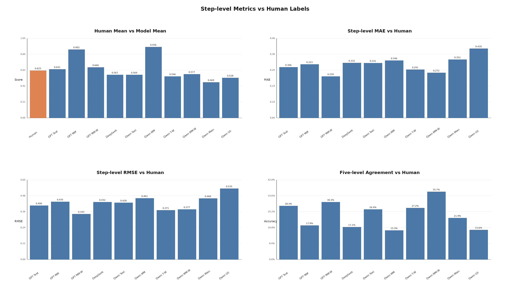
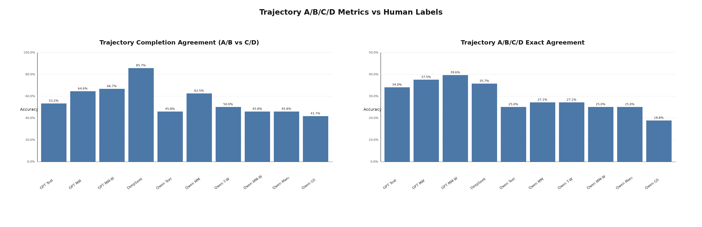

# crossAPP 评分方案完整对比报告

---

## 补充：基于人工标签的总体对比（2026-06-28）

本节以 `output/human/` 下的人工标注作为 ground truth。当前人工标签覆盖 **48 条轨迹 / 621 步**，每条 `human.json` 包含 `step_scores`、`trajectory_grade`、`overall_completed` 和 `subgoal_completed`。统计只在人工标签和模型输出同时存在的共有轨迹/共有步骤上计算，不把缺失轨迹或缺失步骤记为 0 分。

逐步指标中，`Bias = 模型分数 - 人工分数`，正值表示高估；`五档一致` 是将人工分数和模型分数都映射到最近的 `{0.0, 0.3, 0.6, 0.8, 1.0}` 后计算的一致率。

| 模型 | 输出目录 | 轨迹 | 步数 | Human均值 | 模型均值 | MAE | RMSE | Bias | 高估≥0.2 | 低估≥0.2 | Pearson | 五档一致 |
|:---|:---|---:|---:|---:|---:|---:|---:|---:|---:|---:|---:|---:|
| GPT5.5 纯文本单步 | `output/crossapp_codex_text_baseline_all/` | 47 | 591 | 0.639 | 0.641 | 0.306 | 0.406 | +0.002 | 22.8% | 26.1% | 0.226 | 28.3% |
| GPT5.5 多模态单步 | `output/crossapp_codex_mm_baseline_all/` | 48 | 621 | 0.625 | 0.902 | 0.323 | 0.435 | +0.277 | 41.9% | 4.2% | 0.296 | 17.9% |
| GPT5.5 多模态窗口 | `output/crossapp_codex_multimodal_window_all/` | 48 | 621 | 0.625 | 0.666 | **0.250** | **0.343** | +0.041 | 25.0% | 18.5% | **0.419** | 30.3% |
| DeepSeek | `output/deepseek/` | 14 | 287 | 0.566 | 0.567 | 0.332 | 0.432 | +0.000 | 25.1% | 28.2% | 0.340 | 17.1% |
| Qwen 纯文本单步 | `output/crossapp_qwen35_4b_vllm_text/` | 48 | 621 | 0.625 | 0.569 | 0.331 | 0.428 | -0.056 | 21.1% | 34.9% | 0.219 | 26.4% |
| Qwen 多模态单步 | `output/crossapp_qwen35_4b_multimodal_step_v2/` | 48 | 621 | 0.625 | 0.936 | 0.346 | 0.461 | +0.311 | 43.8% | 3.1% | 0.208 | 15.3% |
| Qwen 纯文本窗口 | `output/crossapp_qwen35_4b_text_window/` | 48 | 621 | 0.625 | 0.546 | 0.291 | 0.371 | -0.079 | 21.9% | 36.9% | 0.312 | 27.2% |
| Qwen 多模态窗口 | `output/crossapp_qwen35_4b_multimodal_window/` | 48 | 621 | 0.625 | 0.577 | **0.272** | 0.377 | -0.048 | 20.3% | 28.5% | **0.364** | **35.7%** |
| Qwen 分层记忆多模态 | `output/crossapp_qwen_hier_memory_all/` | 48 | 621 | 0.625 | 0.469 | 0.352 | 0.460 | -0.156 | 13.2% | 44.9% | 0.362 | 21.9% |
| Qwen GS 两步 | `output/crossapp_qwen35_4b_gs/` | 48 | 621 | 0.625 | 0.528 | 0.418 | 0.535 | -0.097 | 20.1% | 40.3% | 0.235 | 15.6% |



轨迹级指标中，`AvgQ-MAE` 是 `summary.avg_q` 与人工 `overall_completed` 的绝对误差；`Composite-MAE` 是 `filtered.raw_scores.composite_completion` 与人工 `overall_completed` 的绝对误差；`Subgoal-MAE` 是 `filtered.raw_scores.step_pass_ratio` 与人工 `subgoal_completed` 完成比例的绝对误差；`Grade一致` 是 `filtered.category` 与人工 `trajectory_grade` 的一致率。

| 模型 | 输出目录 | 轨迹 | AvgQ-MAE↓ | Composite-MAE↓ |  Grade样本 | Grade一致↑ |
|:---|:---|---:|---:|---:|---:|---|
| GPT5.5 纯文本单步 | `output/crossapp_codex_text_baseline_all/` | 47 | 0.353 | 0.286 | 47 | 34.0% |
| GPT5.5 多模态单步 | `output/crossapp_codex_mm_baseline_all/` | 48 | 0.281 | **0.268** | 48 | 37.5% |
| GPT5.5 多模态窗口 | `output/crossapp_codex_multimodal_window_all/` | 48 | **0.264** | 0.277 | 48 | **39.6%** |
| DeepSeek | `output/deepseek/` | 14 | 0.283 | 0.276 | 0.278 | 14 | 35.7% |
| Qwen 纯文本单步 | `output/crossapp_qwen35_4b_vllm_text/` | 48 | 0.378 | 0.310 || 48 | 25.0% |
| Qwen 多模态单步 | `output/crossapp_qwen35_4b_multimodal_step_v2/` | 48 | 0.308 | **0.271** | 48 | **27.1%** |
| Qwen 纯文本窗口 | `output/crossapp_qwen35_4b_text_window/` | 48 | 0.324 | 0.294 | 48 | **27.1%** |
| Qwen 多模态窗口 | `output/crossapp_qwen35_4b_multimodal_window/` | 48 | **0.297** | 0.297 | 48 | 25.0% |
| Qwen 分层记忆多模态 | `output/crossapp_qwen_hier_memory_all/` | 48 | 0.326 | 0.301 | 48 | 25.0% |
| Qwen GS 两步 | `output/crossapp_qwen35_4b_gs/` | 48 | 0.352 | 0.306 | 48 | 18.8% |

### 轨迹 A/B/C/D 分级比较

人工轨迹分布为 **A/B/C/D = 13/17/11/7**。这里直接比较人工 `trajectory_grade` 和各方法 `filtered.category`；`完成判定一致` 只比较是否完成，即人工和模型是否同属 A/B 或同属 C/D。

| 模型 | 样本 | Human A/B/C/D | Pred A/B/C/D | 一致 | 一致率 | 完成判定一致 | 主要偏差 |
|:---|---:|:---:|:---:|---:|---:|---:|:---|
| GPT5.5 纯文本单步 | 47 | 13/16/11/7 | 10/29/0/8 | 16 | 34.0% | 53.2% | 偏宽松，D偏多 |
| GPT5.5 多模态单步 | 48 | 13/17/11/7 | 28/19/0/1 | 18 | 37.5% | 64.6% | 偏宽松，A偏多 |
| GPT5.5 多模态窗口 | 48 | 13/17/11/7 | 6/40/1/1 | **19** | **39.6%** | 66.7% | 偏宽松 |
| DeepSeek | 14 | 7/6/1/0 | 0/11/2/1 | 5 | 35.7% | **85.7%** | 偏严格，D偏多 |
| Qwen 纯文本单步 | 48 | 13/17/11/7 | 10/28/0/10 | 12 | 25.0% | 45.8% | 偏宽松，D偏多 |
| Qwen 多模态单步 | 48 | 13/17/11/7 | 35/13/0/0 | **13** | **27.1%** | **62.5%** | 偏宽松，A偏多 |
| Qwen 纯文本窗口 | 48 | 13/17/11/7 | 1/37/0/10 | **13** | **27.1%** | 50.0% | 偏宽松，D偏多 |
| Qwen 多模态窗口 | 48 | 13/17/11/7 | 3/31/0/14 | 12 | 25.0% | 45.8% | 偏宽松，D偏多 |
| Qwen 分层记忆多模态 | 48 | 13/17/11/7 | 0/26/0/22 | 12 | 25.0% | 45.8% | 偏严格，D偏多 |
| Qwen GS 两步 | 48 | 13/17/11/7 | 4/22/0/22 | 9 | 18.8% | 41.7% | 偏严格，D偏多 |



### 总体结论

1. **逐步分数层面，GPT5.5 多模态窗口最接近人工标签。** 它在 48 条轨迹 / 621 步上的 MAE=0.250、RMSE=0.343、Pearson=0.419，均为当前完整覆盖方法中最优；Bias=+0.041，说明窗口约束有效缓解了 GPT5.5 多模态单步的系统性高估。

2. **轨迹整体完成度层面，GPT5.5 多模态窗口的 `avg_q` 最贴近人工 `overall_completed`。** 它的 AvgQ-MAE=0.264，是全表最低；但若使用框架的 `composite_completion` 和 `step_pass_ratio`，GPT5.5 多模态单步反而在 Composite-MAE=0.268、Subgoal-MAE=0.187 上更低。这说明当前轨迹级过滤指标会被单步高分推高，和逐步人工正确性并不完全一致。

3. **GPT5.5 和 Qwen 的多模态单步都明显高估逐步质量。** GPT5.5 MM Step 的 Bias=+0.277，高估≥0.2 占 41.9%；Qwen MM Step 的 Bias=+0.311，高估≥0.2 占 43.8%。这再次说明“只看单步前后截图”容易把页面变化当成任务推进，不宜直接作为最终数据筛选依据。

4. **Qwen 多模态窗口仍是当前最可靠的本地逐步评分方案。** 在所有 Qwen 方法中，它的逐步 MAE 最低（0.272）、Pearson 最高（0.364）、五档一致率最高（35.7%）。虽然轨迹级 Grade 一致率只有 25.0%，但逐步判断比 Qwen 单步多模态、分层记忆和 GS 更稳定。

5. **A/B/C/D 分级整体仍不理想，需要重新校准筛选阈值。** GPT5.5 多模态窗口的 Grade 一致率最高，但也只有 39.6%；Qwen 最好只有 27.1%。多数方法不会预测 C 类，说明当前规则更倾向在 B 和 D 之间跳转，难以表达“未完成但局部合理”的人工判断。


---

## 补充：crossAPP 全量基准与六模式对比（2026-06-11）

本轮对比基于 crossAPP 六个轨迹集，共 **50 条轨迹 / 645 步**。Codex 已完成三种基准：纯文本单步、多模态单步、多模态窗口；六种 Qwen3.5-4B 模式也已完整跑通，包括新增的分层记忆多模态。统计口径以各模式输出目录下的 `summary.json`、`master_summary.json` 和 `filtered.json` 为准；其中窗口文本的 `llm_scores.json` 会额外包含窗口边界记录，因此最终分析不直接使用该文件的原始步数。

`Codex 多模态单步基准` 使用 `output/crossapp_codex_mm_baseline_all/`，输入为每步执行前/执行后截图和文本描述。它不是绝对真值，但目前作为 50 条轨迹的强评审基准，用来衡量本地 Qwen 模式的偏高、偏低和分类一致性。`Codex 纯文本单步` 缺少 `20250113_21442_test/traj_010`，因此统计为 **49 条轨迹 / 614 步**，其余模式均为 50 条 / 645 步。

### 总体结果

| 模式 | 输出目录 | avg_Q | QA 通过率 | step_pass | A/B/C/D | 结论 |
|:---|:---|---:|:---:|:---:|:---:|:---|
| Codex 多模态单步基准 | `output/crossapp_codex_mm_baseline_all/` | **0.903** | **645/645 (100%)** | **571/645 (88.5%)** | **29/20/0/1** | 当前主基准，视觉和文本共同判断 |
| Codex 纯文本单步 | `output/crossapp_codex_text_baseline_all/` | 0.646 | 614/614 (100%) | 351/614 (57.2%) | 11/30/0/8 | 缺少 1 条轨迹；仅用文本会明显低估早期长轨迹 |
| Codex 多模态窗口 | `output/crossapp_codex_multimodal_window_all/` | 0.666 | 633/645 (98.1%) | 388/645 (60.2%) | 6/41/1/2 | 引入窗口后显著变保守，不适合作为唯一主基准 |
| 纯文本单步 | `output/crossapp_qwen35_4b_vllm_text/` | 0.577 | 633/645 (98.1%) | 290/645 (45.0%) | 10/30/0/10 | 稳定基线，但容易受文本状态描述噪声影响 |
| 多模态单步 | `output/crossapp_qwen35_4b_multimodal_step_v2/` | **0.939** | **645/645 (100%)** | **594/645 (92.1%)** | **37/13/0/0** | 分数异常偏高，必须用人工基准复核 |
| 窗口文本 | `output/crossapp_qwen35_4b_text_window/` | 0.551 | 628/645 (97.4%) | 254/645 (39.4%) | 1/39/0/10 | 更保守，但未证明更接近人工判断 |
| 窗口多模态 | `output/crossapp_qwen35_4b_multimodal_window/` | 0.579 | **645/645 (100%)** | 324/645 (50.2%) | 3/33/0/14 | 分布接近文本模式，但仍需看逐步证据 |
| 分层记忆多模态 | `output/crossapp_qwen_hier_memory_all/` | 0.471 | **645/645 (100%)** | 253/645 (39.2%) | 0/27/0/23 | 历史摘要 + 最近窗口后更保守，低分传播明显 |
| GS 两步 | `output/crossapp_qwen35_4b_gs/` | 0.526 | **645/645 (100%)** | 339/645 (52.6%) | 5/22/0/23 | 输出合规，但视觉匹配过严，D 类最多 |

### 各轨迹集 avg_Q

| 轨迹集 | Codex MM | Codex Text | Codex MM-Win | Qwen Text | Qwen MM | Qwen Text-Win | Qwen MM-Win | Qwen Memory | Qwen GS |
|:---|---:|---:|---:|---:|---:|---:|---:|---:|---:|
| `20250113_21442_test` | 0.870 | 0.369 | 0.614 | 0.286 | **0.884** | 0.404 | 0.456 | 0.346 | 0.420 |
| `20260113_214142_subgoal` | 0.868 | 0.394 | 0.604 | 0.312 | **0.890** | 0.430 | 0.463 | 0.357 | 0.421 |
| `20260422_094450_desktop_bridge_subgoal` | 0.918 | 0.836 | 0.739 | 0.767 | **1.000** | 0.575 | 0.661 | 0.530 | 0.579 |
| `20260423_150127_subgoal` | 0.955 | 0.875 | 0.729 | 0.824 | **0.988** | 0.702 | 0.684 | 0.602 | 0.722 |
| `20260423_190032_desktop_bridge_subgoal` | 0.941 | 0.779 | 0.651 | 0.768 | **0.989** | 0.601 | 0.685 | 0.468 | 0.366 |
| `20260506_1021_subgoal` | 0.879 | 0.812 | 0.736 | 0.813 | **0.938** | 0.687 | 0.662 | 0.633 | 0.694 |

### 相对 Codex 多模态窗口基准的偏差

| 模式 | 匹配步数 | MAE | 平均偏差 | 高估≥0.2 | 低估≥0.2 | A/B/C/D 一致率 |
|:---|---:|---:|---:|---:|---:|---:|
| Codex 多模态单步 | 645 | 0.255 | +0.237 | 37.8% | 1.9% | 52.0% |
| Codex 纯文本单步 | 614 | 0.245 | -0.029 | 18.4% | 23.3% | 65.3% |
| 纯文本单步 | 645 | 0.310 | -0.089 | 17.7% | 34.3% | 52.0% |
| 多模态单步 | 645 | 0.296 | +0.273 | 43.6% | 2.0% | 38.0% |
| 窗口文本 | 645 | 0.228 | -0.115 | 11.9% | 31.0% | **68.0%** |
| 窗口多模态 | 645 | **0.217** | -0.086 | 12.1% | 26.2% | 54.0% |
| 分层记忆多模态 | 645 | 0.280 | -0.195 | 5.9% | 42.8% | 48.0% |
| GS 两步 | 645 | 0.340 | -0.140 | 14.4% | 39.8% | 36.0% |

说明：本表按你的最新要求，以 `Codex 多模态窗口` 作为偏差基准。`MAE` 是逐步分数与 Codex MM-Win 的平均绝对误差；`平均偏差` 为“当前模式分数 - Codex MM-Win 分数”，负值表示相对窗口基准低估；A/B/C/D 一致率按轨迹级分类计算。Codex 纯文本单步只在共有的 49 条轨迹 / 614 步上计算偏差和分类一致率。

### 分析

1. **Codex 三种结果说明“是否看图”和“是否加窗口”会显著改变评分尺度。** Codex 多模态单步 `avg_Q=0.903`，A/B/D 为 29/20/1，能识别少量问题轨迹和弱步骤；Codex 纯文本单步降到 `0.646`，在早期长轨迹集上尤其低；Codex 多模态窗口为 `0.666`，说明窗口上下文让强模型也明显更保守。本节偏差分析以 Codex 多模态窗口为基准，便于比较窗口、多模态窗口和分层记忆这类上下文方法。

2. **Qwen 多模态单步相对窗口基准明显偏高。** 它相对 Codex MM-Win 的平均偏差为 +0.273，高估≥0.2 的步骤占 43.6%，A 类 37 条远高于 Codex MM-Win 的 6 条。它虽然在相对 Codex 多模态单步时最接近，但在窗口尺度下暴露出过度乐观问题，容易把“页面变化”和“目标推进”混同，对弱推进、菜单误点和描述不一致的惩罚不足。

3. **Qwen 纯文本单步稳定但信息不足。** 它相对 Codex MM-Win 的平均偏差为 -0.089，低估≥0.2 的步骤占 34.3%。主要问题是仅依赖 OCR/状态描述时，模型难以判断点击位置、页面真实变化和合理回退，容易把跨页面导航、回到入口、切换应用等必要步骤判低。

4. **Qwen 窗口多模态是当前最接近 Codex MM-Win 的 Qwen 方法，但仍偏低。** 它的 MAE 为 0.217，平均偏差 -0.086；窗口文本 MAE 为 0.228，分类一致率 68.0%。这说明窗口上下文确实把评分尺度拉近了 Codex MM-Win，但当前 4B 模型仍容易被历史步骤、前一步评分和长上下文干扰，导致保守化和低分传播。

5. **新增分层记忆模块未达到预期，当前结果偏低。** 分层记忆多模态 `avg_Q=0.471`，A/B/C/D 为 0/27/0/23；相对 Codex MM-Win 的 MAE 为 0.280，平均偏差 -0.195，低估≥0.2 的步骤占 42.8%。全量 645 步中只有 1 步出现 `critique=N/A` 且 `score=0.0`，说明主要问题不是大面积解析失败，而是历史摘要、已有评分和最近窗口共同造成的保守化与低分传播。

6. **Qwen GS 两步仍然不适合当前主流程。** 它相对 Codex MM-Win 的 MAE 为 0.340，分类一致率只有 36.0%，D 类达到 23 条。主要问题是视觉匹配阶段过严或误判，后续逻辑评分被前置视觉结论压低，导致大量本可解释为合理过渡的步骤被判成异常。

7. **后续评价应以 Codex MM-Win + 人工抽查共同约束上下文方案。** Codex MM-Win 更适合作为窗口、分层记忆等上下文方法的直接对照；Codex MM 单步仍可作为强视觉单步参考。人工三标签用于校验 Codex 与 Qwen 都可能出错的边界步骤，例如菜单误点、弱推进、合理回退和跨应用切换。

---

## 补充：五种方案完整对比（2026-05-20 实测）

### test 集性能对比

| 指标 | DeepSeek | Text(单步) | Text(窗口) | MM(单步) | MM(窗口) |
|:----|:--------:|:----------:|:----------:|:--------:|:--------:|
| **think_ok** | 80/81 (99%) | **81/81 (100%)** | **81/81 (100%)** | 28/81 (35%) | 36/81 (44%) |
| **avg_Q** | **0.588** | 0.486 | 0.422 | 0.920* | 0.248 |
| 平均每步耗时 | ~2s | ~4s | ~12-17s | 3~170s | 38~92s |
| 筛选A/B/C/D | 0/3/0/1 | 0/4/0/0 | 0/2/0/2 | — | 0/0/0/4 |

> *MM 单步 avg_Q 偏高是因为模糊步 score 缺失未被计入。MM 窗口 avg_Q 大幅降低是因为上下文混淆导致模型倾向给低分。

### subgoal 集性能对比

| 指标 | DeepSeek | Text(单步) | Text(窗口) | MM(单步) | MM(窗口) |
|:----|:--------:|:----------:|:----------:|:--------:|:--------:|
| **think_ok** | 207/209 (99%) | **209/209 (100%)** | **209/209 (100%)** | 64/209 (31%) | ~30/72 (42%) |
| **avg_Q** | **0.551** | 0.503 | 0.419 | 0.849 | ~0.27-0.39 |
| QA通过率 | 99% | **100%** | **100%** | 31% | ~40% |
| 筛选A/B/C/D | 0/8/2/0 | 0/7/0/3 | 0/3/0/7 | 2/8/0/0 | 无汇总 |

### 关键发现

1. **Text Window**：保持 100% think 完整率和 QA 通过率，但 avg_Q 从 0.50 降至 0.42（上下文使模型更保守）。subgoal 集仅 3/10 条被归为 B，其余 7 条全部降为 D。
2. **MM Window**：think 完整率从 31% 提升至 44%（上下文帮助缓解了 think 缺失），但 avg_Q 从 0.85 暴跌至 0.25（窗口上下文产生评分矛盾时模型倾向给 0.0）。test 集全部归为 D。
3. **MM Window subgoal 不完整**：仅 4/10 条轨迹处理完成，且未生成汇总报告。
4. **纯图片模式**已证不可行，不再对比。

### 完整方案对比总结

| 方案 | think_ok | avg_Q | 每步耗时 | 本地方案 | 视觉验证 |
|:----|:--------:|:-----:|:--------:|:--------:|:--------:|
| **DeepSeek** | 99% | 0.551 | ~2s | ❌ | ❌ |
| **Qwen 纯文本（单步）** | 100% | 0.503 | ~4s | ✅ | ❌ |
| **Qwen 纯文本（窗口）** | 100% | 0.422 | ~14s | ✅ | ❌ |
| **Qwen 单步多模态** | 35% | 0.849* | 3~170s | ✅ | ✅ |
| **Qwen 滑动窗口多模态** | 44% | 0.248 | 38~92s | ✅ | ✅ |

---

## 一、模型概况

| 模型 | 简称 | 类型 | 部署方式 | 调用成本 |
|------|------|------|----------|----------|
| **DeepSeek v4 Pro** | DS | 云端大模型 | `active_model: "deepseek"` | API 按量计费 |
| **Qwen3.5-4B 纯文本单步** | Text | 本地 4B | `active_model: "qwen_local"` | 免费（Ollama） |
| **Qwen3.5-4B 纯文本窗口** | Text-Win | 本地 4B + 滑动窗口 | `run_text_window_pipeline.py` | 免费（Ollama） |
| **Qwen3.5-4B 多模态单步** | MM | 本地 4B + 截图 | `active_model: "qwen_local_mm"` | 免费（Ollama） |
| **Qwen3.5-4B 多模态窗口** | MM-Win | 本地 4B + 截图 + 滑动窗口 | `run_sliding_pipeline.py` | 免费（Ollama） |

---

## 二、逐轨迹评分对比（avg_Q）

| 轨迹 | 步数 | **DS** | **Text** | **Text-Win** | **MM** | **MM-Win** |
|------|:----:|:------:|:--------:|:----------:|:------:|:----------:|
| traj_007（test） | 20 | **0.742** | 0.545 | 0.485 | 0.920* | 0.275 |
| traj_009（test） | 18 | **0.597** | 0.517 | 0.525 | 0.911* | 0.233 |
| traj_010（test） | 31 | **0.511** | 0.468 | 0.327 | — | 0.207 |
| traj_027（test） | 12 | **0.517** | 0.392 | 0.408 | — | 0.333 |
| traj_004（subgoal） | 21 | **0.500** | 0.381 | 0.376 | 0.905* | 0.271 |
| traj_005（subgoal） | 25 | **0.632** | 0.620 | 0.442 | 0.824* | 0.388 |
| traj_007（subgoal） | 20 | **0.633** | 0.585 | 0.485 | 0.920* | 0.275 |
| traj_009（subgoal） | 18 | **0.583** | 0.572 | 0.525 | 0.911* | 缺失 prm |
| traj_010（subgoal） | 31 | 0.439 | 0.458 | 0.327 | 0.710* | — |
| traj_012（subgoal） | 19 | 0.550 | 0.568 | 0.429 | 0.789* | — |
| traj_015（subgoal） | 20 | **0.617** | 0.455 | 0.435 | 0.920* | — |
| traj_019（subgoal） | 21 | 0.552 | 0.500 | 0.394 | 0.924* | — |
| traj_026（subgoal） | 22 | 0.555 | 0.509 | 0.419 | 0.855* | — |
| traj_027（subgoal） | 12 | 0.458 | 0.317 | 0.408 | 0.783* | — |

> **注意**：MM\* 的 avg_Q 偏高（0.710~0.924），因为模糊步 score 缺失未被计入平均。窗口方案 avg_Q 普遍偏低（模型受上下文影响更保守）。Text-Win 在这两者之间取得平衡，且 100% 可靠。

---

## 三、核心指标汇总

| 指标 | **DS** | **Text** | **Text-Win** | **MM** | **MM-Win** |
|------|:------:|:--------:|:----------:|:------:|:----------:|
| 总评测步数 | 290 | 290 | 290 | 290 | 153* |
| **加权 avg_Q** | **0.551** | 0.503 | 0.419 | 0.849 | ~0.27 |
| **QA 通过率** | 285/290 (98%) | **290/290 (100%)** | **290/290 (100%)** | 91/290 (31%) | ~36/81 (44%) |
| **三项标签完整率** | 286/290 (99%) | **290/290 (100%)** | **290/290 (100%)** | 91/290 (31%) | ~44% |
| 单步响应时间 | ~2s | ~4s | ~14s | 3~170s | 38~92s |
| 本地部署 | ❌ 需 API | ✅ | ✅ | ✅ | ✅ |
| 视觉验证能力 | ❌ | ❌ | ❌ | **✅** | **✅** |

> *MM-Win subgoal 仅 4/10 条轨迹（72 步）完成处理，汇总为 153 步 = 81(test) + 72(subgoal)。

---

## 四、评分一致性分析

**五模型同时给出 ≥0.8 高分**的步骤在 traj_007 中极少（几乎所有窗口方案步骤评分均低于 0.8）。窗口方案因为上下文约束，评分倾向于保守。

**核心矛盾**：Text-Win 与 MM-Win 在各步骤评分上系统性偏低，与 DS 或 Text 单步的高分形成鲜明对比。

**分歧最大的步骤**（traj_007, 五方案对比）：

| 步 | 动作 | DS | Text | Text-Win | MM | MM-Win | 分歧原因 |
|:--:|:----:|:--:|:----:|:--------:|:--:|:------:|:---------|
| 5 | 点击会员中心 | 1.0 | 0.3 | 0.9 | 1.0 | 1.0 | Text 单步误判，但窗口+MM 均正确 |
| 10 | 奢华酒店榜 | 0.9 | 0.6 | 0.95 | 1.0 | 0.0 | MM-Win 窗口矛盾→给零分 |
| 12 | 点击榜单菜单 | 0.3 | 0.2 | 0.45 | 1.0 | 0.0 | MM-Win 持续给零分模式 |
| 15 | 口碑榜（点错） | 0.9 | 0.2 | 0.4 | 0.8 | 0.0 | MM 正确识别点击偏差，Win 一律零分 |
| 18 | Back（点错） | 0.1 | 1.0 | 0.2 | 0.6 | 0.0 | DS 异常低估，Text 异常高估 |
| 20 | 故宫详情 | 0.9 | 0.9 | 0.85 | 1.0 | 0.9 | ✅ 五方案一致高分 |

---

## 五、各模型问题清单

### DeepSeek
- 少数步骤评分异常偏低（traj_007 步7=0.1、步14=0.1、步18=0.1），原因不明
- 需要网络连接和 API Key
- 云端推理涉及数据隐私

### Qwen3.5-4B 纯文本
- **系统性的低估倾向**：大量正确步骤只给 0.2~0.4，avg_Q 比 DS 低 0.05~0.15
- 无法感知点击位置偏差（步8、15、18 无法发现点错）
- 对系统状态栏噪声敏感，易误判

### Qwen3.5-4B 多模态（单步）
- **think 标签缺失率 69%**：`repeat_penalty: 2.0` 在打断循环时连带抑制思考标签
- **无限循环**：模糊场景下自疑复发，需手动 `repeat_penalty` 压制
- **速度不稳定**：简单步 3s，模糊步 170s
- QA 通过率仅 31%：缺失 think 标签被 DensityEvaluator 拒绝
- subgoal 集 10 条全部跑通，但 QA 通过率一致在 10~40%

### Qwen3.5-4B 纯文本滑动窗口（Text-Win）
- **系统性 low-score 倾向**：avg_Q 从 0.50 降至 0.42，所有轨迹评分偏低
- **筛选结果偏严**：subgoal 集仅 3/10 条 B，其余 7 条均归为 D（单步 Text 有 7 条 B、0 条 D）
- **速度较慢**：每步 ~14s（受滑动窗口 3 步上下文拼接影响），4 倍于单步纯文本
- **无视觉验证能力**：同单步纯文本，无法发现点击偏差
- **但 100% 可靠**：QA 通过率 100%、think 完整率 100%，零维护

### Qwen3.5-4B 多模态滑动窗口（MM-Win）
- **avg_Q 最低**：test 集仅 0.248（全方案最低），窗口上下文导致模型普遍给 0.0
- **think 缺失率改善有限**：从 69% 降至 56%，仍不足
- **速度不稳定但范围收窄**：38~92s，比单步 MM 的 3~170s 更可预测
- **处理不完整**：subgoal 仅 4/10 条有产出，traj_009 缺 prm_scores
- **筛选结果全部 D**：test 集 4 条全部归为"未完成_逻辑异常"
- **唯一优势**：保留了视觉验证能力，在极端情况下能发现点击位置偏差

---

## 六、最佳使用建议

| 场景 | 推荐方案 | 原因 |
|------|----------|------|
| **生产数据标注/最终筛选** | 🏆 **DeepSeek** | 评分最合理、输出完整、QA 通过率 98% |
| **本地开发/快速调试** | 🏆 **Qwen Text 单步** | 100% 可靠、速度快、零维护成本 |
| **本地批量处理（无网络）** | 🏆 **Qwen Text 单步** | 不需 API，全本地运行，100% 可靠 |
| **需要 think 完整且接受低分** | 🏆 **Qwen Text 窗口** | 100% think 完整，适合对 think 完整率有硬要求的场景 |
| **点击位置验证/质检抽样** | 🏆 **Qwen MM 单步** | 唯一能发现点击偏差的方案，适合抽样 |
| **视觉验证 + think 补全** | ⚠️ **Qwen MM 窗口** | 效果有限，avg_Q 过低导致筛选结果无区分度 |

**流水线配置**：`LLM_caller/config.yaml` 中切换 `active_model` 即可。

---

## 七、数据来源

- **DeepSeek 结果**：`output/deepseek/`
- **Qwen3.5-Text 单步结果**：`output/qwen3.5-4b/`
- **Qwen3.5-Text 滑动窗口结果**：`output/qwen-text-window/`
- **Qwen3.5-MM 单步结果**：`output/qwen3.5-4b-image-text/`
- **Qwen3.5-MM 滑动窗口结果**：`output/qwen3.5-4b-image-text-window/`
- **报告生成时间**：2026-05-20

---

## 补充：GUI-Shepherd (GS) 两步评分方案实验（2026-05-27/28）

### 设计目标

GS 方案的核心理念是 **分离视觉识别与逻辑评分**，消除多模态模型在同时处理截图和文本时的上下文冲突：

```
Step 1 (视觉层): 仅截图 → 填空识别 UI 元素 + 匹配判断，不评分
    Prompt: "图中标注的点击位置对应的UI元素是：____
            该元素与动作描述是否一致：____（一致/不一致）"

Step 2 (逻辑层): 纯文本 → Step1 结论 + 状态描述 → 最终得分
    Prompt: "视觉扫描结果: {step1结论}
            评分规则: 不一致→0; 一致→看状态进展→0/1"
    输出: 【最终得分: 0】或【最终得分: 1】
```

### 方案 A：Qwen 3.5 4B 多模态模型（本地 Ollama）

**配置演进：**

| 参数 | 初始值 | 最终值 | 原因 |
|:---|:---|:---|:---|
| `max_tokens` | 256 | 1024 | 256 太低，模型思考截断，结论丢失 |
| `think` | true | false | 尝试抑制 CoT 冗长输出（实测无效） |
| `repeat_penalty` | 1.0 | 1.5 | 2048 tokens 时模型陷入死循环 |

**test 集结果（20250113_21442_test，4 条轨迹 / 81 步）：**

| 轨迹 | 步数 | 得分步 | avg_Q |
|:---|---:|---:|:---:|
| traj_007 | 20 | 5 | 0.250 |
| traj_009 | 18 | 2 | 0.111 |
| traj_010 | 31 | 3 | 0.097 |
| traj_027 | 12 | 1 | 0.083 |
| **汇总** | **81** | **11** | **0.136** |

筛选结果：全部 D 级。

### 方案 B：DeepSeek v4 Pro（云端 API）

**失败。** DeepSeek API 返回 `unknown variant 'image_url', expected 'text'` —— DeepSeek v4 Pro 不支持图片输入，无法执行视觉识别步骤。

### 问题诊断

**问题不在流水线架构，而在模型能力。**

三个层次的证据：

1. **流水线逻辑正确。** 当 step1 成功识别"一致"时，step2 100% 正确给 1 分。分离架构本身没有逻辑缺陷。

2. **Qwen 3.5 4B 多模态视觉能力不足。** 模型对 GUI 截图中标注框的识别极不可靠：
   - 经常声称"用户并没有标注框"（实际有绿色/蓝色标注框）
   - 在简单步骤中循环分析同一元素数十次
   - `think: false` 通过 Ollama API 设置对该模型无效，仍输出冗长 CoT

3. **token 预算两难。** 256 tokens 时结论被截断，2048 tokens 时模型陷入死循环。1024 + `repeat_penalty: 1.5` 是最佳折中，但模型能力上限未变。

4. **DeepSeek 不支持视觉。** 纯文本模型无法承担 step1 职责。

### 当前状态

| 方案 | 模型 | avg_Q | 状态 |
|:---|:---|---:|:---|
| GS 两步 (Qwen MM) | `qwen3.5:4b` | 0.136 | ❌ 视觉能力不足 |
| GS 两步 (DeepSeek) | `deepseek-v4-pro` | — | ❌ 不支持图片 |
| GS 两步 (混合) | Qwen MM + DeepSeek text | — | ⚠️ 未测试 |

### 结论

GS 两步分离的设计理念正确，但受限于可用模型：
- **本地 4B 多模态模型** 的 GUI 元素识别能力不足以作为可靠的 step1 评分器
- **云端 DeepSeek** 不支持多模态输入
- 需要一个 **支持图片输入且视觉能力足够强** 的模型来承担 step1 职责

当前最优方案仍为 DeepSeek 纯文本单步（avg_Q=0.551）和 Qwen Text 单步（avg_Q=0.503）。

---

- **Qwen3.5-GS 两步结果**：`output/qwen3.5-4b-text-image-gs/`
- **报告生成时间**：2026-05-20（原报告），2026-05-28（GS 补充）
